# Malware 3/3 (Reverse - 200 points) - bluesheet

## Énoncé

Ouf ! Vous avez réussi à récupérer le malware, à vous connecter sur le serveur de l'attaquant et à récupérer la clé privée (fichier `key.priv` ci-joint) ayant servi à chiffrer votre précieux flag.

Le fichier `key.priv` portait initialement le nom : `0fdb0eea57198b3bb69e8267690ede5d5ba95ab791638a610372120b773d4acc_2021-03-15|21:34:41.priv`.

Dechiffrez le fichier `flag.txt` pour valider cette épreuve.


## Résolution

Examinons les fichiers à notre disposition :
* Une clé privée RSA,
* Un fichier `flag.txt` chiffré,
* Un exécutable ELF x86, le malware Command & Control.

Ouvrons l'exécutable avec Ghidra afin de comprendre comment le fichier `flag.txt` a été chiffré.

### Rétro-ingénierie statique du code côté client

Je cherche la chaîne de caractères `"flag.txt"` dans l'exécutable, pour remonter à ses cross-references (là où elle est utilisée). J'atterrirai probablement proche de l'endroit où le fichier est chiffré.

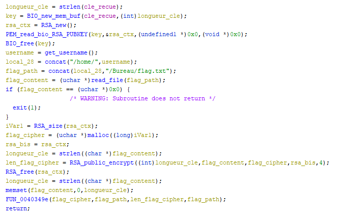

Au cours de la rétro-ingénierie, j'essaie de renommer autant que possible les variables et les fonctions, en leur donnant des noms plus descriptifs que `local_XX` ou `iVarX`. Ici, j'ai procédé de la manière suivante :
1. Regarder la signature de la fonction `PEM_read_bio_RSA_PUBKEY` (dont le symbole était déjà présent dans l'exécutable), et renommer les paramètres de cette fonction de manière cohérente (`key`, `RSA_ctx`).
2. Renommer les paramètres de `BIO_new_mem_buf` correspondant à l'affectation de `key`.
3. Renommer `longueur_cle` de manière cohérente, étant donné l'affectation à `strlen(cle_recue)`.
4. Inspecter et comprendre le contenu de la fonction `get_username`, qui ne s'appelait pas encore `get_username`, mais dont le contenu est assez explicite :

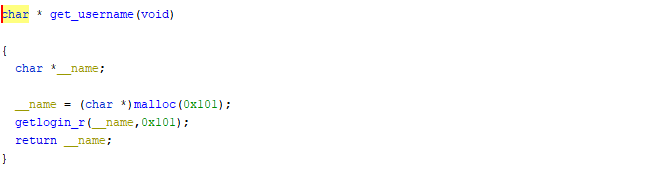

5. Idem avec la fonction `concat` :

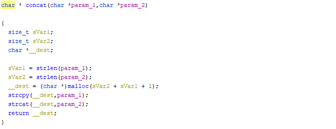

6. Renommer `flag_path` de manière cohérente avec son contenu.
7. Examiner la signature de la fonction `RSA_public_encrypt` et renommer les paramètres de manière cohérente. *Notons ici le dernier paramètre, correspondant au padding, fixé à la constante **4**.* Aussi, la variable `longueur_cle` est réutilisée par le compilateur pour stocker la logueur du flag.
8. Je me rends compte au moment de l'écriture de ce write-up que je n'ai pas renommé la fonction `FUN_0040349e`. Voici son contenu :

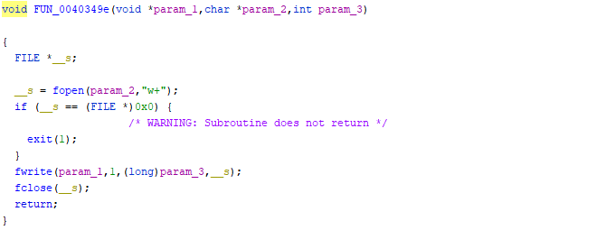

Je choisirai donc de la renommer `write_file`.


Voilà, cette fonction est maintenant plus propre, et on commence à avoir une idée de ce qui arrive à notre flag : il est chiffré avec une clé publique RSA, qui est passé en paramètre de la fonction sur laquelle nous travaillons, que je vais nommer `encrypt_flag`.

Regardons maintenant les cross-references de notre fonction `encrypt_flag`, pour trouver l'origine de la clé publique RSA passée en paramètre.


[...]

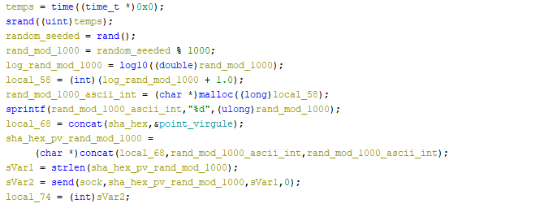

[...]

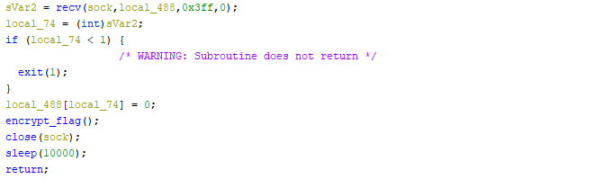

*Extraits de la fonction parente de `encrypt_flag`, variables et fonctions renommées par une méthode similaire à celle détaillée plus haut.*

On remarque une erreur de désassemblage lors de l'appel à `encrypt_flag`, mais `local_488` (qui pourrait en réalité s'appeler `donnees_recues`, voire `cle_recue`) semble un bon candidat pour être son paramètre. Ainsi, la fonction parente effectue les actions suivantes :
1. Hacher la chaîne `username@password` avec `SHA256` (on a vu dans `Malware 1/3` qu'il s'agissait de `forensics@fcsc2021`), concatène le digest avec un `;`, puis avec un entier entre **0** et **1000** généré par une fonction `rand()`, seedée par le timestamp de l'instant d'exécution.
2. Envoyer cette chaîne à travers la socket (vers la machine de l'attaquant donc)
3. Recevoir par la socket la clé publique qui servira à chiffrer le flag.


Logiquement, ma prochaine étape va consister en l'examen du code côté serveur, pour déterminer comment la paire de clés RSA est générée.  
Pour cela, je vais regarder les cross-references de la fonction `send`. Cette dernière est référencée deux fois, donc une que l'on vient d'examiner. Allons jeter un oeil sur cette seconde cross-reference !

### Rétro-ingénierie statique du code côté serveur

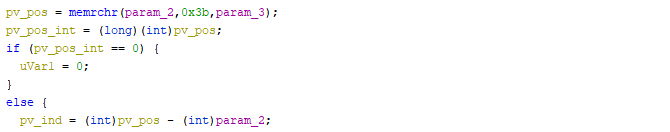

[...] *(0x3b correspond au caractère ';'... `param_2` est certainement la chaîne envoyée par le client.)*

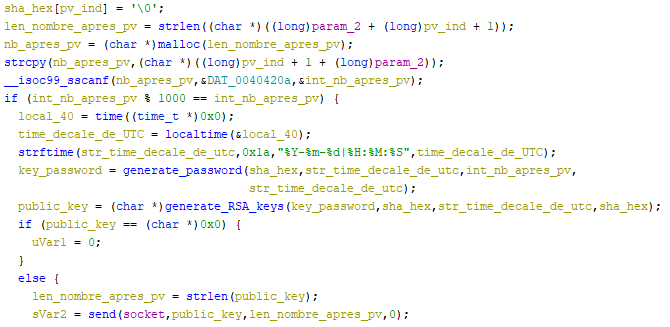

*Extraits de la fonction qui référence `send`.*

A noter : à ce stade lors de ma résolution, la fonction `generate_password` n'était pas encore nommée. La fonction `generate_RSA_keys` est par contre très lisible, et son utilité comme ses paramètres sont facilement déterminables.

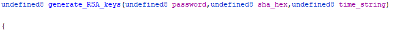
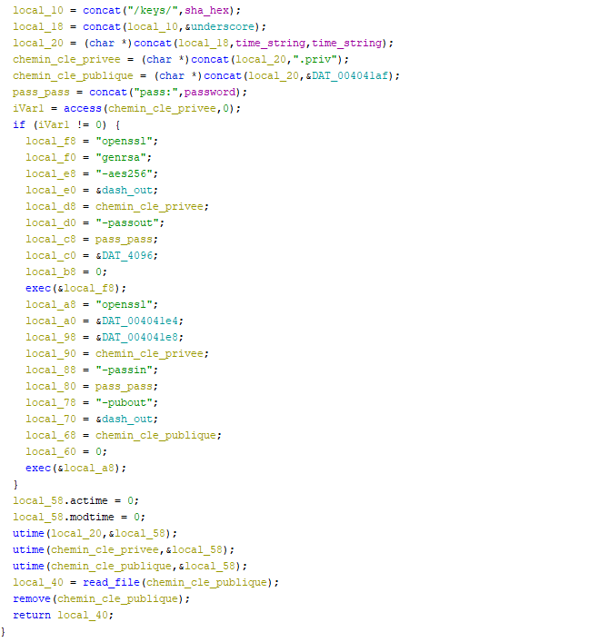

Je sais maintenant d'où provient le nom de la clé privée donné dans l'énoncé ! Une rapide vérification confirme que `SHA256("forensics@fcsc2021") = 0fdb0eea57198b3bb69e8267690ede5d5ba95ab791638a610372120b773d4acc`  
Attention toutefois, la date indiquée dans le nom de la clé est générée par le **serveur**, et le petit entier envoyé par le client est généré par le **client**, il y a donc un délai entre les deux (principalement causé par la latence sur le réseau). De plus, la date affichée dans le nom de la clé passe par une fonction adaptant la date au fuseau horaire du serveur, là où le timestamp du client est fixé sur UTC. Aussi, l'entier envoyé par le client n'est pas très grand (entre 0 et 999). Pour cela, j'ai décidé de ne pas me fier à la date générée par le serveur, et de plutôt tester tous les entiers possibles (plutôt que de tenter de seeder le random côté client à date - 3600, puis -7200, puis -3601, puis ...)

Reste à décortiquer la fonction `generate_password`, que j'ai pu nommer en remarquant que sa sortie était utilisée comme mot de passe pour la clé privée RSA.

Mais avant cela, il me semble intéressant de réaliser un bilan sur l'architecture de ce malware.

### Architecture du Malware

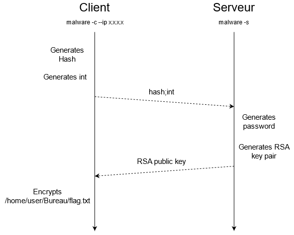

L'exécutable dispose des fonctionnnalités de client et de serveur. Lorsqu'il est lancé en mode client (avec le flag `-c`), il envoie à l'IP spécifiée (par le flag `--ip`) une chaîne de caractère composée d'un hash (qui sert d'identifiant unique) et un entier (qui servira à générer le mot de passe de la clé privée). Il attend ensuite la réception d'une clé publique RSA, puis chiffre le fichier `flag.txt` à l'aide de cette clé.  
Lorsqu'il est en mode serveur (flag `-s`), il écoute l'arrivée de nouveaux clients, génère le couple de clés RSA en fonction de la chaine envoyée par le client, et renvoie la clé publique RSA au client.

### Rétro-ingénierie statique de `generate_password`

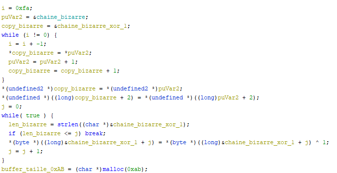

*Début de la fonction `generate_password`*

Pour l'instant rien de très compliqué, une chaîne de caractère étrange est copiée depuis la section `.data` dans la stack, et tous les caractères de cette chaîne sont XORés avec **0x1**.  
S'en suit un appel à la fonction `FUN_004037c0`, qui est une sorte de machine à états qui avance sur cette chaîne de caractères. Je la mets de côté pour l'instant et continue la lecture de `generate_password`.

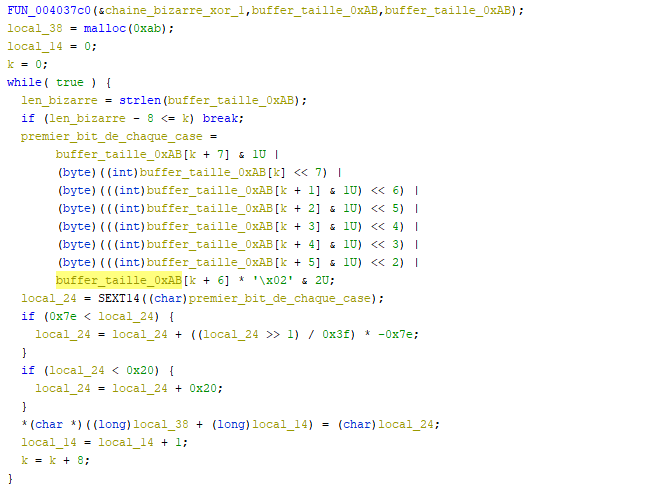

*Les complications...*

Les choses se compliquent, mais sont encore faisables. Je continue de lire la fonction jusqu'au bout, hisoire de m'aider dans mon renommage futur.

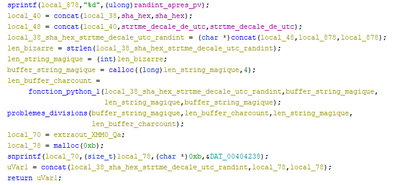

C'est ici que j'ai réalisé que je n'arriverai pas au bout du reversing de cette fonction... On peut voir `fonction_python`, une fonction dont j'ai tenté de répliquer le fonctionnement en python, mais surtout **`problemes_divisions`**, une fonction qui mène au bout de code suivant :

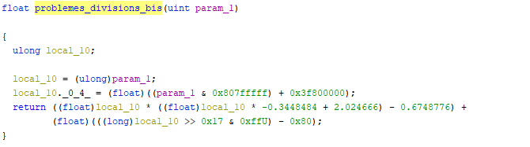

Cette fonction, je n'arriverai pas à la reverse... En somme, je ne suis pas capable de reverse la fin de la fonction `generate_password`.

**MAIS**

Je sais qu'elle n'a pas de side-effects, et je connais ses paramètres ! Je peux donc directement l'appeler dans `gdb` pour obtenir le password généré !

### `generate_password` - la revanche...

*Scripting time !*

```python
import gdb
gdb.execute("b *0x402687", False, False) # breakpoint à l'entrée de main
gdb.execute("b *0x403cb7", False, False) # breakpoint au return de generate_password
gdb.execute("r", False, False)

passlist = ""

begin = 0
end = 1000

for i in range(begin, end):
    passlist += str(i) + " : "
    for k in range(2): # jsp pourquoi, mais appeler la fonction une seule fois ne marche pas
        # On doit faire un try catch parce que breakpoint = exception
        try:
            gdb.execute("p ((char* (*) (char*, char*, int)) (0x40396d)) (\"0fdb0eea57198b3bb69e8267690ede5d5ba95ab791638a610372120b773d4acc\", \"2021-03-15|21:34:41\", "+str(i)+")", False, False)
        except:
            pass
    cle = gdb.execute("print (char*)$r8", False, True)
    passlist += cle + "\n"


f = open("gdb_passwords_"+str(begin)+"-"+str(end)+".txt", "w")
f.write(passlist)
f.close()
```

Comme dit plus haut, quitte à tester un entier, autant tester les 1000 ! Ce n'est pas beaucoup plus long, et m'assure que le mot de passe sera dans le fichier généré.

### Récupération de la clé privée

Ainsi, j'enchaîne sur un one-liner bash, en travaillant sur une version épurée du fichier généré :

```bash
while read -r line; do echo $line && openssl rsa -in key.priv -passin pass:"$line" -check 2> /dev/null; done < passwords.txt
```

J'obtiens un retour pour un unique password (`n = 578`). La clé privée est déchiffrée !!

### Déchiffrement de `flag.txt` avec la clé prifée

Il ne reste plus qu'à déchiffrer le flag avec la clé privée, en se rappelant bien de la constante de padding rencontrée dans l'exécutable : **4**. Celle-ci correspond, d'après [les headers](https://github.com/openssl/openssl/blob/master/include/openssl/rsa.h), à la constante nommée `RSA_PKCS1_OAEP_PADDING`. Je rédige donc un rapide dernier script afin de déchiffrer le fichier `flag.txt` :

```python
from Crypto.Cipher import PKCS1_OAEP
from Crypto.PublicKey import RSA

key = RSA.importKey(open('key.decrypt').read())
cipher = PKCS1_OAEP.new(key)

f = open("flag.txt", "rb")
raw = f.read()
f.close()
message = cipher.decrypt(raw)
f = open('decoded_flag.txt', 'wb+')
f.write(message)
f.close()
```

Et **le tour est joué !** Le flag apparaît, en caractères gothiques.
